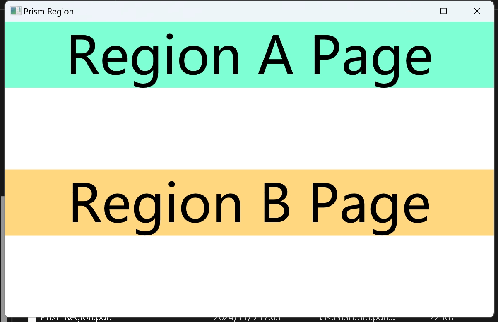
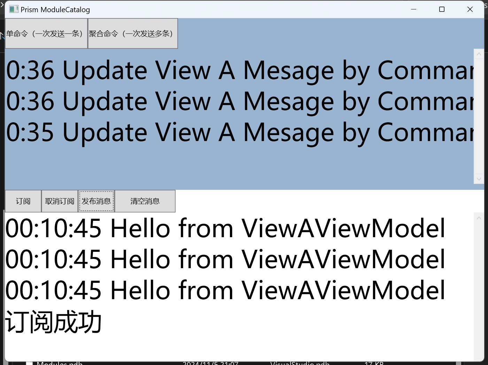
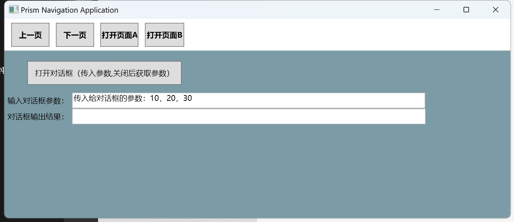

# PrismLearning

## 简介
这是一个Prism的学�j项目，主要用于学习Prism的使用。共包含的三个项目，分别是PrismRegion、ModulesCatalog、Navigation。

## 项目PrismRegion
这个项目主要用于学习Prism的Region的使用。主要包含了以下内容：
1. Region的基本使用
2. Region的激活
3. Region的导航
演示效果图如下所示：

## 项目ModulesCatalog
这个项目主要用于学习Prism的模块化开发。主要包含了以下内容：
1. 模块的加载，包括了四种加载方式。App.config、XAML、代码、目录
2. 模块的初始化
3. 模块的卸载

演示效果图如下所示：

## 项目Navigation
这个项目主要用于学习Prism的导航。主要包含了以下内容：
1. 导航的基本使用
2. 导航的传参
3. 对话框服务的使用

演示效果图如下所示：

